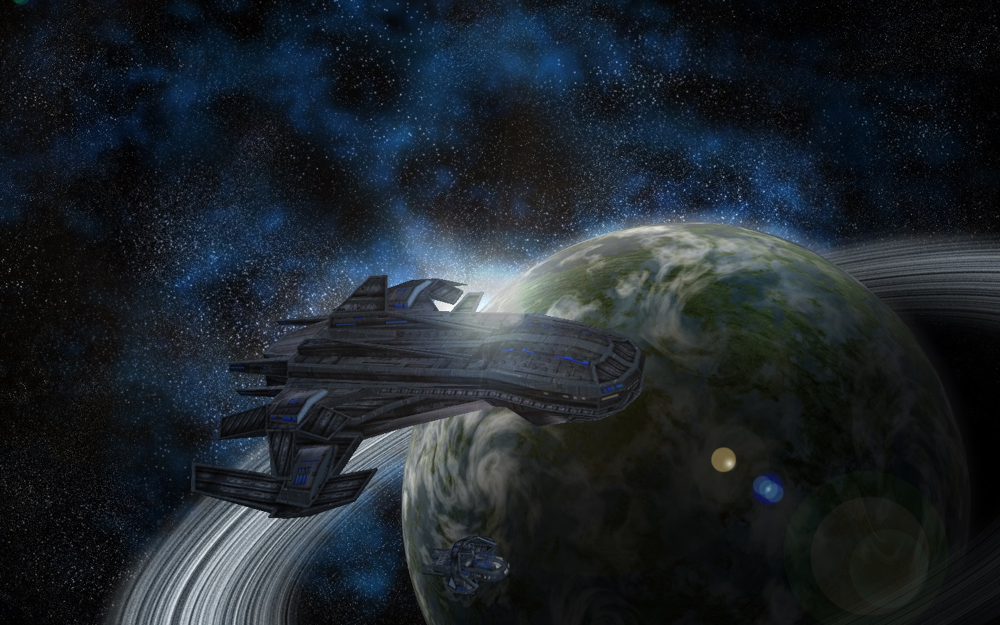
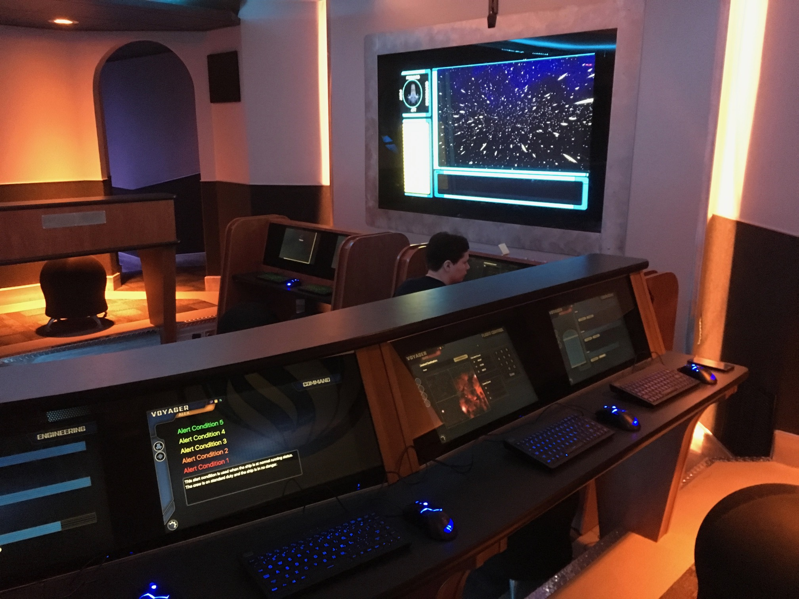
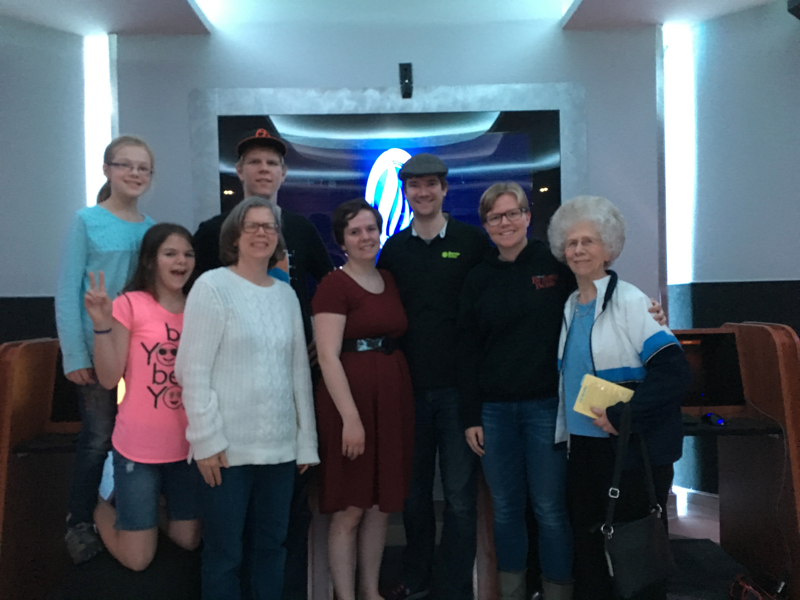
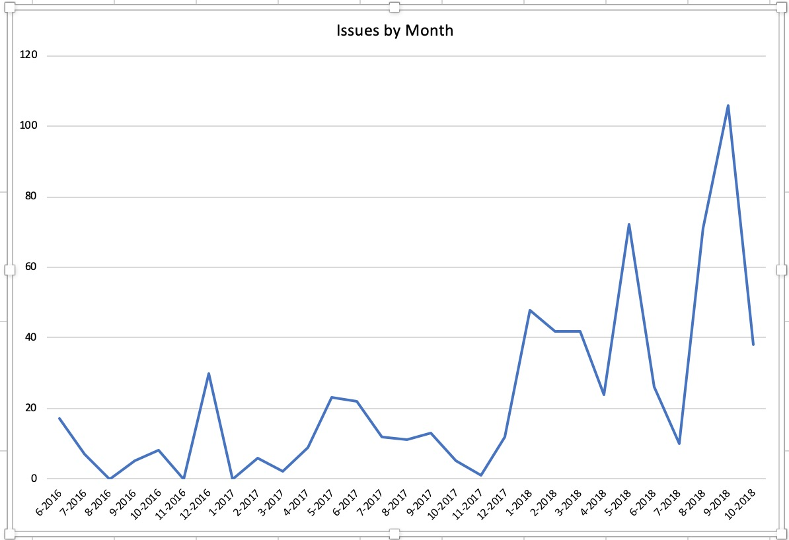

In my [last post](/how-to-build-a-space-ship-part-2-the-plans), I talked about how the Voyager would be constructed. Guess what? It was! You can [visit them today](https://www.spacecamputah.org), and you totally should. A lot of work went into it, and still goes into it. It's really come together.

It wasn't without its challenges and problems. One of the first casualties was Flint, the JavaScript-based controls which were developed in tandem with the simulator. These controls were intended to be the brains of the entire simulator. They would controls the lights, sounds, music, ambiance, and naturally the station controls. It would be an integrated simulator like no other. Or so we hoped.

Most of the features were developed into Flint, but unfortunately it missed the mark. It was super complicated to configure, difficult to use, and not reliable. We were so interested in building these innovative features that we didn't think through how to do it right. We didn't have any attention focused on the actual station controls. Even worse, we didn't pace ourselves. Without a fun environment to work in and with a plethora of pressures on us, Brent and I quickly burnt out, and progress on Flint slowed to a crawl.

The simulator was able to open with most of its show controls in place and with a backup set of controls, but it wasn't ideal. Neither of us were satisfied with the results, but there wasn't much to be done.

Or was there?

---

As it turns out, building spaceship simulator controls is a really great way to learn new things. I learned how to program when I build the Revolution/LiveCode simulator controls back in the day; I learned more about JavaScript, HTML, and Node by developing Flint. There were some new technologies coming out that I was interested in pursuing - specifically React, Elixir, and GraphQL. Maybe I could start making some controls, you know, just to learn these techs. Who knows where it would go?

I started this project in June of 2016, I started working on this project, dubbed Thorium. In fact, I [wrote about it a little bit](/elixir-funtime). One of the biggest struggles of the Flint project was the fact that the features and direction of the project were being dictated by a creative team that couldn't come to consensus. Without knowing what the roadmap was, it was impossible to make meaningful progress. I wanted to avoid those pitfalls by keeping the project to myself. This was to be a learning opportunity.

Progress at first was slow, but that's mainly because I was learning so much. Elixir was an entirely different paradigm; GraphQL was similar. It took me a long while to finally figure out how everything was supposed to work together, but I got a working prototype put together.

There were a couple of ways I wanted to build on previous simulator controls:

- It should be totally composable. This was brought to the table by Mercury, which allowed flight directors to distribute cards to whatever stations they want.
- It should support effects controls, like sound effects, lighting, viewscreens, and more. Flint was the first to pioneer centralized effects.
- It should have all of the cards and screens necessary to work for any current or future ship. It should be possible to use Thorium for a small shuttle, a larger battleship, a carrier, or even a submarine. All of these should be possible.
- It should also be a platform for innovating new features and screens. That was a huge piece of the reason why Flint was built - to create new screens for the Farpoint universe. Thorium should be able to meet that expectation.
- It should support multiple themes, so each simulator can have its own look and feel.

I was going to approach Thorium a little bit differently though:

- It was going to be built with the latest and best technologies. Simulator controls are complicated, and in order to make them as functional and performant as possible, it would a bit of a boost.
  - React makes it really easy to build complicated, state-based layouts and matched the needs of Thorium perfectly.
  - GraphQL make it very easy to get specific data from a server on-demand. The Subscription features which GraphQL brings to the table make it insanely easy to do realtime data.
- I was going to focus this project on learning first, marketing later. The primary of purpose was to learn; nothing more, nothing less. Having other people involved in the project would easily take away from that educational environment.
- I wanted to build a team to help work on the controls. This is actually the reason I dropped Elixir and Docker in favor of Node for the backend. Elixir is cool, and would totally fit the needs of Thorium. On the other hand, it's a bit harder to learn and isn't as ubiquitous as Node making it more difficult for people to pick up. Using Node makes it easier for others to jump in and contribute. Also, in 2016, the GraphQL Subscriptions story was much better in Node than Elixir (it's much better now than it was).
- I wanted to actually finish the controls. To me, that meant being able to run a simulation from start to finish with a real crew in a real simulator. Flint's failure still stung, so I wanted to make sure these controls were completed.

Thorium was going to change a couple of things about simulator controls too:

- All previous simulator controls are simulator-centric. All of the state is centered in the simulator. This doesn't work in the era of long-duration missions. Thorium would be more flight-centric, allowing for pausing, concurrent flights, and coming back to flights later.
- The flight director should have as much power and control as possible. Their job is to make sure the crew has the best time possible during their flight. Everything in Thorium should either make it easier for the flight director to give the crew a great time, or remove distraction from the flight director, or both.
- Missions would be very centralized, allowing for the viewscreen to be connected to the controls and for actions like sending long range messages and answering scans to be automated by the timeline.
- Flight directors could be assisted by actionable notifications through the Core Feed, a new feature that hopefully would make it easier for the flight director to do their job.
- While it wasn't the intention to begin with, Thorium was eventually open-sourced, allowing anyone to contribute to Thorium, or even fork it and do their own thing with it. This would make it easier for outside contributors to help build it.

Fast-forward a year and I did it. I built a set of simulator controls. I'll talk more about the process I went through in later blog posts, but the point is that I had come to the point where Thorium was ready to be shown off. Up to this point, only a select few people knew about these controls. I started having one-on-one meetings with the space center directors, showing them the controls, and getting feedback.

I also started doing test flights, which was great fun. It allowed me to bring my family and friends to the space center to finally show off what I've been working on for so long. The feedback from the test flights was great. People were excited about the controls and gave mostly positive feedback about the experience. (Fortunately, they didn't notice all of the major problems happening behind the scenes).

I didn't expect it when I first opened up Thorium to the space centers, but my learning process was not complete. Customer support and project management were the next things I would learn more about, and I wasn't even expecting it. Working with the space centers to make Thorium better has been a pleasure and delight, but it hasn't been easy. There have been a lot of issues submitted.

Thorium has been a great success in a lot of ways. It also hasn't worked out so well in many ways. For example, I haven't had much success in getting repeat contributors to help me work on Thorium. It was my hope that something like that could happen, but it just hasn't worked out yet. Maybe it will someday. (If you're interested in working on Thorium, get in touch on the [Discord server](https://discord.gg/UvxTQZz)!)

Interested in playing with Thorium? [Check it out!](https://thoriumsim.com) You can [download it for free](https://thoriumsim.com/download), and even [read and edit the code](https://github.com/thorium-sim/thorium).

Enjoy!

