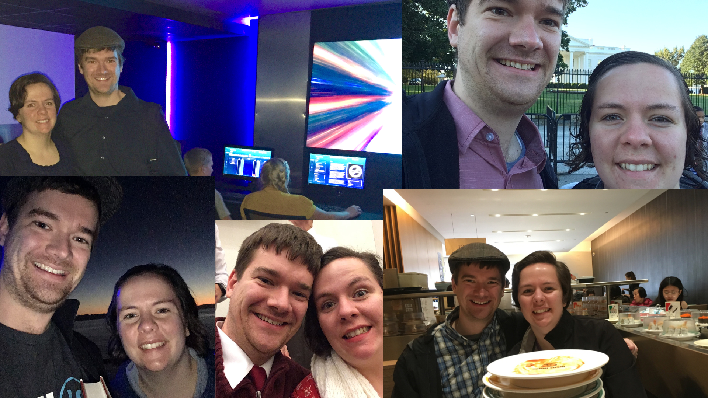

Here's my regular report on the past year. In one word: terrific! It was a great year, personally, professionally, intellectually, and in just about every other way. Certainly it wasn't without its challenges, but I'm just going to focus on the good.

- I'm still married to Crystal! (As if the picture above wasn't evidence enough.) We celebrated our first wedding anniversary, along with several excursions to celebrate and strengthen our relationship. We celebrate two years of marriage tomorrow!
- As far as my goals, I certainly did lots of reading, although I did a poor job of documenting the books I completed during the year. I went to several React and Silicon Slopes meetups, and I spoke about Thorium at the Provo Linux User Group meetup. I also attended a conference, React Rally, which was definitely the professional highlight of my year. I'll talk more about that later. The one goal I was deficient in was writing more - as evidenced by this blog, my writing has been limited to just the past month. I did find myself more involved on [Twitter](https://twitter.com/ralex1993), which does count as writing. You can troll my profile to see what was on my mind. I also taught more, as part of the IS Academy program at BYU, the WebDev Guild, and the Programming Department.
- WebDev Guild classes continued during the Spring of last year, at which point they concluded. They have been replaced by the Programming Department, and organization more focused on training developers to work on [Thorium](https://thoriumsim.com), the spaceship simulator controls, instead of being about teaching general web development principles.
- Thorium has found a significant amount of reach and support as the community has grown. It began being used in actual simulators during the beginning of last year, and the [Discord](https://discord.gg/UvxTQZz) server (which also was started early last year) has steadily grown. The Discord server has been an interesting place where people from all background come and share what they are planning on doing with Thorium. This fun project borne out of a desire to become a better developer has grown to help many different people accomplish their space simulator dreams.
- As part of Thorium's growth, I started the Simulator Controls Advisory Board, a regular meeting of all of the Space Edventures Center directors to discuss how we can best cooperate with our space centers and simulator controls. I also have been working hard to recruit developers by having workshops and hackathons, all of which have been relatively well attended.
- We took a trip to Seattle to visit Crystal's sister. Her nephew was getting baptized, and we wanted to take the opportunity to case the city out and see if we would enjoy living there (I would, Crystal was hesitant). We enjoyed exhibits in the Museum of Popular Culture, Pikes Place, and the general atmosphere of the pacific northwest.
- We also took an impromptu trip to San Diego for Crystal's brother's wedding. Funtime!
- Crystal and I have become more politically involved, attending town hall meetings and debates. Crystal even volunteered for one of the campaigns.
- Crystal and I took several fun trips during the summer, including a day at Lagoon (Crystal's first time going), a weekend getaway and spa vacation to Snowbird, and a family reunion (her family) to Eden, which was tremendous fun (I've got great in-laws).
- After almost 4.5 years of employment, I quit my job at BlenderBottle. I definitely have to credit my time at BlenderBottle for the reason I have learned so much about programming and development. After my brother left and I took the lead web development role, the additional responsibility was taking its toll. While I was able to keep things running well and hopefully make some improvements, it was becoming more and more stressful for me, and I realized there wasn't keeping me there. I recognized that having a mentor is really valuable for me at this point in my career, and the kind of mentor I need isn't present at BlenderBottle. I enjoyed my time there and have missed my coworkers, but I realized it was time for me to have a different experience. Currently, I'm doing contract work for one of my professors, working on the spaceship controls, doing my schoolwork, and looking for work (if you know of any remote or Utah-based web development job opportunities, let me know!).
- My beloved car, Sunny, died. It was tragic. We got a new car. His name is Bruce. (I know it's not a huge deal, but I figure the biggest single expense of the year deserves some shout-out).
- React Rally was amazing! It was a great opportunity to learn some new things, meet some new people, rub shoulders with famous people (I ran into one of the speakers before his keynote, pacing nervously - it was the third or fourth best part of the conference), promote my spaceship controls a bit (somebody came up to me out of the blue and said "Hey, are you the spaceship guy?" - second or third best part), and discuss Brandon Sanderson books with a bunch of really awesome people (best part of the conference!). I feel so much more connected to the React community, and hope to continue my involvement. I definitely will be attending again.
- I started my last year of school. Finally.
- Crystal and I started rock climbing together. It's been our go-to exercise and amusement activity, and has become a big part of our lives this year.
- Crystal and I took a trip to Washington DC! It was most excellent, and worked out well. Crystal had a training for her work, and I had a couple of days off. We went to several of the museums, memorials, and monuments. We enjoyed tasty food and good entertainment at Ford's Theater. Crystal's aunt was our personal tour guide on one day, showing us around the city and sharing some really cool facts and ideas. It was awesome!
- After our DC trip, we moved from Orem to Midvale, Utah to be closer to my wife's work. It's been a great move, so far.
- Crystal and I finished up our year on a cruise to Mexico, which was most wonderful. It was nice to be able to relax and enjoy ourselves without stressing about work, school, anything on the internet... anything at all really! We came back happy, relaxed, and exited for the year ahead!

2019 is also looking out to be a good year:

- I graduate in April, and start a new job in May (what job? Who knows! Let me know if you have a job opportunity).
- I plan on continuing to work on the simulator controls. My involvement will steadily decrease over time, but it will continue to be a pet project.
- Crystal and I intend to continue climbing and maybe hope to get good enough so we can climb outside.

And, a few goals:

- Become a better helper in the community, be it online or in person, as a developer or otherwise. One way I hope to do this is by speaking at a conference.
- Become a better chef. My wife will help me by giving me regular ingredient baskets, Chopped style - I have the best wife!
- Become a better teacher. This is an area where I feel I have a lot to share, but am not necessarily good at sharing it.
- Heck, might as well say I'll write more. No harm in saying it.

Cheers!
