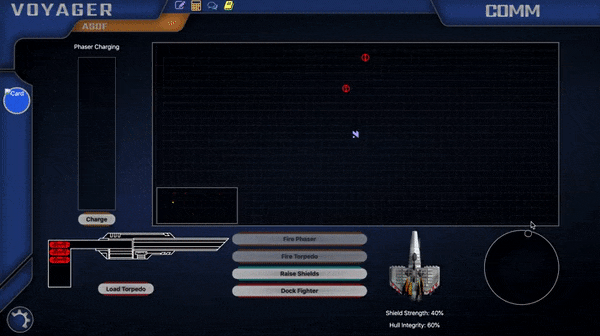

Sometimes, in a fever of genius, you write an opus of code, magnificent in its function, unknowable in its complexity. These brilliant pieces of work are given simple interfaces which allow mere-mortal components to call the function of splendor without having to understand the breadth and depth of its inner workings. All who gaze upon it are struck with awe and terror at the code blocks and definitions, not daring to touch it in the slightest.

And then you have a piece of code that is simple, effective, easy to understand, and performant; everything you could possibly want out of a function.

Today, I tell the story of each of these.

## The Goal


For the Sensor Grid of the Thorium, all of the animation is calculated on the server. This allows multiple sensor grids across several clients to remain in sync. The server sends updates down to the client via WebSockets and GraphQL subscriptions.

To keep the network traffic low and not require cache normalization so often, the framerate for sending these updates down to the client is limited to 20 frames per second, or once ever 50 milliseconds. However, smooth animation runs at 60fps, or ever 16 milliseconds. In order to bridge the 34 millisecond gap between those two frame rates, the client has to add in extra frames. This is called interpolation. The simplest form of interpolation does it in uniform steps, or in a linear fashion. This is called Linear Interpolation, or LERP.

Since these sensor contact movement updates were coming through React context, I figured I needed to keep track of the interpolated values using React state, which means I need a custom hook to store and calculate these values. Enter: `useInterpolate`.

## useInterpolate

This hook uses a number of sub-hooks. The first is pretty simple: `usePrevious`

```javascript
function usePrevious(value) {
  // The ref object is a generic container whose current property is mutable ...
  // ... and can hold any value, similar to an instance property on a class
  const ref = useRef([value])

  // Store current value in ref
  useEffect(() => {
    ref.current.unshift(value)
    ref.current = ref.current.slice(0, 2)
  }, [value]) // Only re-run if value changes

  // Return previous value (happens before update in useEffect above)
  return ref.current[1] || ref.current[0]
}
```

This hook keeps track of the previous value of a variable, updating it's own cache whenever the variable changes. This is used to see what the previous location of the sensor contacts was before they were animated to their new location.

`useAnimationFrame` updates the state at 60fps so we can have the smooth animation.

```javascript
const useAnimationFrame = (callback, active = true) => {
  const callbackRef = useRef(callback)
  const time = useRef(performance.now())

  useLayoutEffect(() => {
    callbackRef.current = callback
  }, [callback]) // eslint-disable-line react-hooks/exhaustive-deps

  const frameRef = useRef()

  useLayoutEffect(() => {
    const loop = now => {
      const diff = now - (time.current || now - 16)
      time.current = now
      frameRef.current = requestAnimationFrame(loop)
      const cb = callbackRef.current
      cb(diff)
    }
    if (active) {
      time.current = performance.now()
      frameRef.current = requestAnimationFrame(loop)
    } else {
      cancelAnimationFrame(frameRef.current)
    }
    return () => cancelAnimationFrame(frameRef.current)
  }, [active])
}
```

You provide it with a callback, and it runs that callback as fast as it can, up to 60 frames per second. This "as fast as it can" is an important thing to note. If the operation takes more than 16 milliseconds to run, then the framerate will drop.

Finally, the completed `useInterpolate` which brings it all together.

```javascript
function lerp(v0, v1, t) {
  return v0 * (1 - t) + v1 * t
}

function useInterpolate(inputs, interval) {
  const [contacts, setContacts] = useState(inputs)
  const endTime = useRef(Date.now() + interval)
  const previousInputs = usePrevious(inputs)
  const inputsRef = useRef(inputs)
  useEffect(() => {
    endTime.current = Date.now() + interval
    inputsRef.current = inputs
  }, [inputs, interval]) // eslint-disable-line react-hooks/exhaustive-deps

  useAnimationFrame(() => {
    let t = Math.max(
      0,
      Math.min(1, Math.abs(1 - (endTime.current - Date.now()) / interval))
    )
    const contactIds = contacts.map(c => c.id)
    const inputObj = inputsRef.current.reduce(
      (acc, c) => ({ ...acc, [c.id]: c }),
      {}
    )
    const previousInputObj = previousInputs.reduce(
      (acc, c) => ({ ...acc, [c.id]: c }),
      {}
    )
    const inputIds = Object.keys(inputObj)
    const newContacts = inputsRef.current.filter(
      ({ id }) => contactIds.indexOf(id) === -1
    )
    const filteredContacts = contacts
      .filter(({ id }) => inputIds.indexOf(id) > -1)
      .map(c => {
        if (!previousInputObj[c.id] || !inputObj[c.id]) return null
        return {
          ...c,
          ...inputObj[c.id],
          position: {
            x: lerp(
              previousInputObj[c.id].position.x,
              inputObj[c.id].position.x,
              t
            ),
            y: lerp(
              previousInputObj[c.id].position.y,
              inputObj[c.id].position.y,
              t
            ),
          },
        }
      })
      .filter(Boolean)
    setContacts(newContacts.concat(filteredContacts))
  })
  return contacts
}
```

I don't even want to talk about what's going on here. It's a mess. There's crazy loops and so much state being thrown around. The good news is that I got it working; the bad news is that it doesn't work well. You see, all the stuff I've got going on inside `useAnimationFrame` takes longer than 16 milliseconds to run, so it's slow and choppy, especially as the number of contacts increases.

This is my opus. It's so confusing that even I can't decipher it now.

## The Elegant Solution

As I was playing around with this, I wondered if I had any other tools at my disposal that could make this work better. As it turns out, there were! There is an excellent feature of web browsers that has LERP-ing built-in!

CSS Transitions.

Here's the final code for interpolating values:

```css
.contact {
  transition: transform 50ms linear;
}
```

And here's what it looks like:



Lesson learned: Sometimes, you can do it simpler and faster. Strive to find those solutions.
