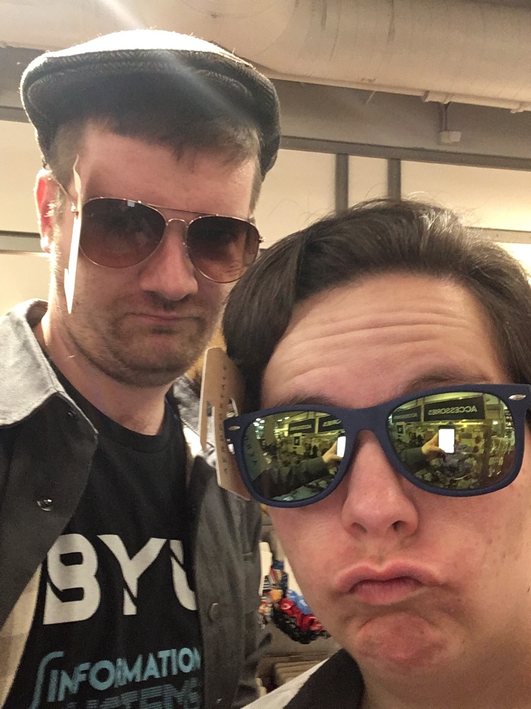

When it comes to years, 2019 was definitely a banger! Here's a few goals and happenings.

- I've continued to work on [Thorium](https://thoriumsim.com), which recently hit version 2.0. For my masters capstone project, I also created [SpaceEdventures.org](https://spaceedventures.org), a site for tracking space center missions and earning points towards ranks. This was a fun project which, at the time, demonstrated my best work. This service is currently in use in at least one of the space centers, and I'm pleased with how it turned out. I'm also stunned and awed by the amazing community which has sprung up around Thorium. It's always a pleasure working with the wonderful users of this humble spaceship software.
- Crystal and I tried our hand at making several unfamiliar recipes, including kanafeh, fondue, sous vide, cheese making, and various kinds of bread and pastries. We also grew a lush garden.
- I graduated from BYU with a Masters of Information Systems degree! I started school in 2011, so this has been a long time coming and I'm glad it's over. I've learned a lot and gained a lot of wonderful friends in the process. I'm just glad I never have to go to school again (although I do intend to keep learning as much as I can). Crystal on the other hand...
- After studying really hard, taking the LSAT, getting a really high score, and applying to Boston University, Crystal has officially been accepted to law school. She'll be going to BU in the fall, focusing on immigration law. This means we're moving to Boston. Crystal has visited there, and I lived in Pennsylvania for 2 years during my mission (see my earlier blog posts for more information about that), so we're relatively familiar with East Coast living. Still, it will be a big change, and we're both very excited for the move.
- After applying a bunch of places, I got a job at Instructure, the company that makes the Canvas LMS. I'm doing front-end work full-time, which is really nice next to my full-complete-all-the-way-up-and-down-the-stack work with Thorium. My team is excellent, my boss is arguably the best I've ever had, and the product that I'm working on is something I really believe in and think will add a lot of value to the world. I've already been instrumental in shipping the first iteration of it, and my work is well praised. They'll let me stay on remotely when I move to Boston, so I anticipate working for Instructure for several more years.
- Crystal and I got into bicycling. I would still be riding it to work if the weather weren't so cold, but I plan on picking it up again in the spring and hopefully bringing the bikes to Boston.
- Crystal's family had a big reunion out in Minnesota, and we were fortunately able to go. We saw the many lakes, went to Mackinac Island (no cars, lots of bikes), and played lots of games. It was a good summer break.
- Crystal and I repeated our trip to Snowbird, much to our relaxment.
- I started playing Dungeons and Dragons with my coworkers, which really opened my eyes to the possibilities of role-playing games. Thorium fits into that bucket, as an on-computer role-playing game with game master behind the scenes.
- I hit a bit of burn-out with Thorium. Working for Instructure full-time left me with less time to devote to Thorium, and I was still working on it at a feverish rate. I decided, finally, to cut back and stop working on it so much. My stress levels have decreased substantially since that moment, and while I will still maintain it, I won't work on it quite as much as I have in the past.
- On the other hand, my community involvement has increased substantially. I spoke at two conferences this year - UtahJS and React Conf. The latter is where I [spoke about Thorium](https://www.youtube.com/watch?v=aV0uOPWHKt4). As part of that, I had a dry-run with [Tom Occhino](https://twitter.com/tomocchino), the engineering manager of the React team at Facebook. As I described the work I put into Thorium for both the crew and flight director, he said "This sounds awesome! I would love to do this, especially as the flight director." That struck a chord with me. I've been focusing on making Thorium for existing flight directors, but not so much for non-flight directors that might happen to be good D&D dungeon masters. That reignited a fire to make Thorium easier for the average person to pick up and start telling great stories with.
- As for the conferences themselves, all three (I also attended React Rally again) were great experiences. I loved meeting more people and making more connections withing the development community, and of course I picked up a lot of great ideas from the talks that I watched. I don't know when I'll speak at a conference again, but I plan on being a regular conference goer in the future.
- In the meantime, I started working on some other side projects, which I hope to release this year. Stay tuned!
- Crystal and I finished off our year with our regular trip to San Diego. This time, we went down to the San Diego zoo one day and Sea World another. I can now finally say that I've seen those sights, after so many years of visiting.
- I've also gotten more into home automation. I currently only have a few smart plugs, but I'm doing research into more things we can outfit our home with once we move to Boston.

As for my goals:

- I spoke at 3 meetups, 4 in-office trainings, and 2 conferences and have tried to be as helpful as possible on Twitter and in other forums.
- I've cooked a lot of things, and most of them have turned out great! I'm very pleased with where my cooking is taking me.
- I haven't taught as many classes as before, but have spoken at work several times about a variety of topics.
- I've written a lot more on this blog, as shown by the posts which filled several months of the year. I'll be getting back into blogging again this year too.

Here's to 2020, which will include at least one visit to Boston before we move there, a several-day cross country road trip, settling into a new home, and continued work on projects at Instructure and Thorium.

And the goals for this year:

- Work on some more side projects to broaden my portfolio outside of just Throium.
- Maintain a good relationship with family, friends, and colleagues back home as I move to Boston.
- Start working on some of my more ambitious Thorium projects, including the 3D viewscreen.
- Speak at one or more meetups in Boston.
- Learn more and invest in some smart home stuff; don't get hacked.
- Be more mindful of how I eat by setting down my fork after every bite.

Cheers!
