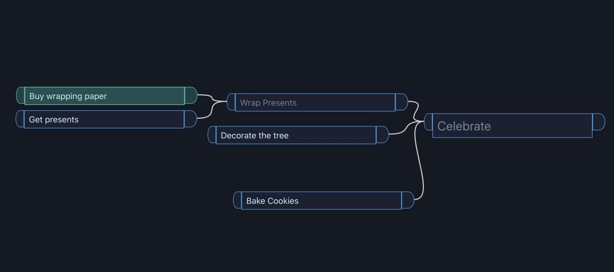

A lot has already been written about [RecoilJS](https://recoiljs.org), the new orthogonal<sup>1</sup> state manager for React. Many articles have been written [about what it is and how it works,](https://mariosfakiolas.com/blog/recoiljs-is-meant-to-rock-your-react-world/) and [how it compares to other state management systems](https://blog.bitsrc.io/manging-state-with-recoil-in-react-application-aecdbfd371b7).

However, not much has been written about a headline feature of Recoil - state persistence. Even the documentation is currently woefully lacking in descriptions and examples of how to store and load data from an app that uses Recoil. This is mainly due to the feature still being under development and unstable. However, existing versions do support it. Just remember, everything I write about here could change in a future update. Be warned.

I've tried out a couple of methods of state persistence with Recoil, and I'll show you how it works. I'll assume that you are roughly familiar with Recoil works; if you aren't, give the docs and those blog posts a read.

And of course, if you know a better way, [let me know](https://twitter.com/compose/tweet?text=%40ralex1993).

## Persistent State

When using pretty much every form of state management, all of the data is stored in memory - if the browser is reloaded or closed, everything gets erased. That is, unless, you store that data somewhere else. You can put it in the browser's local storage if the data doesn't need to be portable. If you're sharing state between browsers and computers, you can use an API call to send it to a server database, serialize it to a URL's GET parameter, or download the data to your user's computer.

We'll only be discussing storing our data in local storage, but once the data is serialized, you can store it in whatever format you prefer.

## Our Recoil Tree

Recoil is most useful when the state we are storing frequently updates and has several independent parts. We'll make a node graph-based task management system, where lines can be drawn to dependencies on the left, and dependents on the right.



We won't worry about the code for building the UI for this, but you can [view it on GitHub](https://github.com/alexanderson1993/tasky).

We'll need a few atoms and selectors for this. The first will define each individual task. We'll use an atom family to handle memoizing each atom.

```js
export const taskFamily = atomFamily({
  key: "TaskFamily",
  default: (id) => ({
    id,
    title: "New Task",
    status: "none", // Either "none", "in-progress", or "completed"
    x: 0, // These are the coordinates for where the
    y: 0, // task node will appear on the screen
  }),
})
```

We'll also need a regular atom to handle storing a list of task IDs.

```js
export const taskList = atom({
  key: "TaskList",
  default: [],
})
```

The last atom we'll need is for a list of connections. Out connections will be a list of objects containing an ID for the "left" node and an ID for the "right" node.

```js
export const connections = atom({
  key: "Connections",
  default: [],
})
```

One of the best parts of Recoil is its ability to create data graphs with selectors. We'll use a selector family to get the left and right position of any connections, and another to merge our individual tasks with the task list.

```js
// Create a list of the full task data
export const tasks = selector({
  key: "Tasks",
  get: ({ get }) => {
    const allTasks = get(taskList)

    return allTasks.map((taskId) => get(taskFamily(taskId)))
  },
})

// Grab the coordinates of each connection to make
// it easier to draw lines
export const connectionPosition = selectorFamily({
  key: "ConnectionPosition",
  get: ({ left, right }) => ({ get }) => {
    const leftTask = get(taskFamily(left))
    const rightTask = get(taskFamily(right))

    return {
      source: { x: rightTask?.x || 0, y: rightTask?.y || 0 },
      target: { x: leftTask?.x || 0, y: leftTask?.y || 0 },
    }
  },
})
```

## Storing State

Before we can store our data in any kind of storage, we need to serialize is somehow.

Serializing data in Recoil is an unstable feature, but it's still available in the published version. `useRecoilTransactionObserver_UNSTABLE` is a named export of the `recoil` package, and calls a function every time any Recoil state is changed. We'll wrap it in a custom React hook so we can reuse it.

```js
export function usePersistStorage() {
  useRecoilTransactionObserver_UNSTABLE(({ snapshot }) => {
    processSnapshot(snapshot)
  })
}
```

The [snapshot is a special Recoil object](https://recoiljs.org/docs/api-reference/core/Snapshot) that allows you to query for any Recoil data using some methods attached to the snapshot. We pass that to our `processSnapshot` function. Since this happens on _every_ state change, we will want wrap our `processSnapshot` function in a [debounce higher-order function](https://css-tricks.com/debouncing-throttling-explained-examples/) which will keep our storage from saving too often.

If we only wanted to save when our user clicked a 'save' button, we could use the `useRecoilCallback` hook, which also provides a snapshot:

```js
const saveState = useRecoilCallback(({ snapshot }) => () => {
  processSnapshot(snapshot)
})

// ...
saveState()
```

What does `processSnapshot` do then? It's going to use the `snapshot.getPromise()` method to get a promise which resolves the current value of whatever snapshots and selectors we request. Recoil only uses promises (or loadables) in snapshots because it has first-class support for asynchronous data in selectors. Using an `async` function allows us to `await` the atom and selector data.

We can then serialize that data into JSON and store it in local storage.

```js
async function processSnapshot(snapshot) {
  const persistedConnections = await snapshot.getPromise(connections)
  const persistedTasks = await snapshot.getPromise(tasks)

  localStorage.setItem(
    "tasky_storage",
    JSON.stringify({
      tasks: persistedTasks,
      connections: persistedConnections,
    })
  )
}
```

You might be wondering why I don't serialize all of my atoms, like `taskList`?. Since the `tasks` selector gets all the data I need, I don't need to serialize every atom.

Okay, why don't I serialize `connectionPosition`? All of that data is derived from data which I'm already serializing; adding it to my storage would needlessly take up space.

## Loading State

Now that the data is stored, we can retrieve and load it when our Recoil app is loaded. The `<RecoilRoot>` component which wraps our app accepts an `initializeState` prop which we can use to load our data into our Recoil state.

```js
ReactDOM.render(
  <RecoilRoot initializeState={initState}>
    <App />
  </RecoilRoot>,
  rootElement
)
```

`initState` is a function which gives us a mutable snapshot - one which we can change. We'll take advantage of that ability to set the atoms and selectors based on our stored data. The `snapshot.set` function takes an atom (or selector) and the value you want to set it to.

```js
export function initState(snapshot) {
  const data = localStorage.getItem("tasky_storage")
  if (!data) return
  const {
    tasks: persistedTasks,
    connections: persistedConnections,
  } = JSON.parse(data)

  persistedTasks.forEach((t) => {
    snapshot.set(taskFamily(t.id), t)
  })
  snapshot.set(
    taskList,
    persistedTasks.map((t) => t.id)
  )

  set(connections, persistedConnections)
}
```

Now, when Recoil first loads, it will pull in our data from local storage and put it into the appropriate atom. We need to remember to put our task data into both the `taskList` atom, to keep them in a list, and the `taskFamily` atom, to keep the detailed data. Our `initState` function could be an `async` function if we were pulling data from a server.

---

Using this method means you are manually serializing and de-serializing the data from your atoms and selectors. This is obviously a bit more work - it would be nice if you could just `JSON.stringify(snapshot)` but it has it's benefits. One thing which the Recoil documentation has suggested is how much easier this makes handling changes to your store structure which makes backwards compatibility much easier.

I hope this demystified adding state persistence to apps that use Recoil. If there is anything that I got wrong or that I could do better in this, [feel free to reach out](https://twitter.com/compose/tweet?text=%40ralex1993).

---

<small><sup>1</sup> The description on Recoil's website is a <a href="https://twitter.com/jevakallio/status/1281185768237674497?s=20">little intimidating</a>. Just know it manages state, can pass values between separate parts of the React tree, is really good at updating React components only when needed.</small><br /><br /><br />
